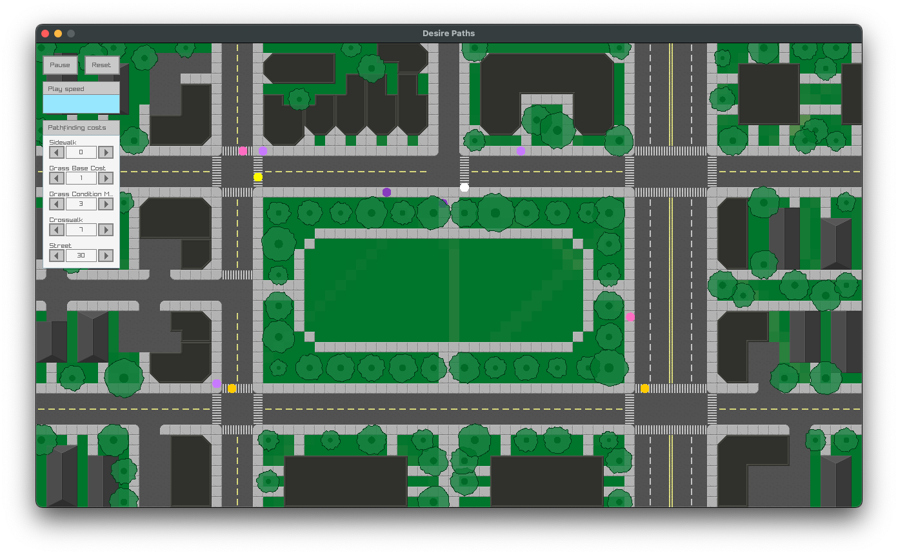
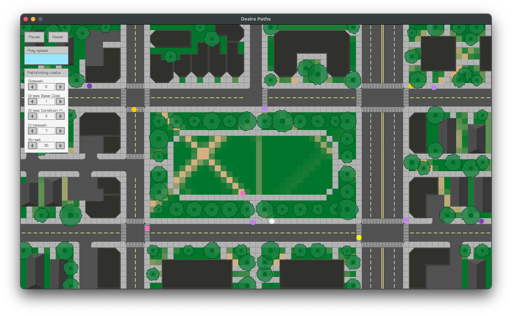
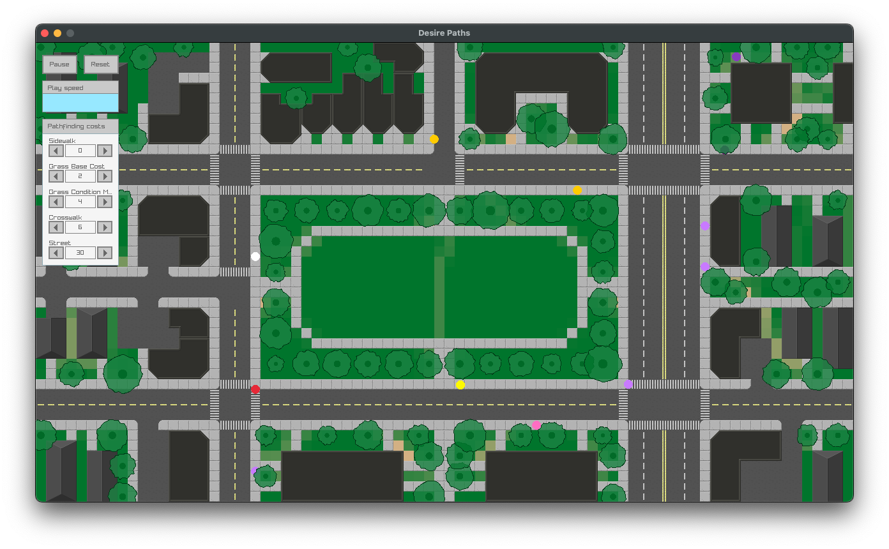
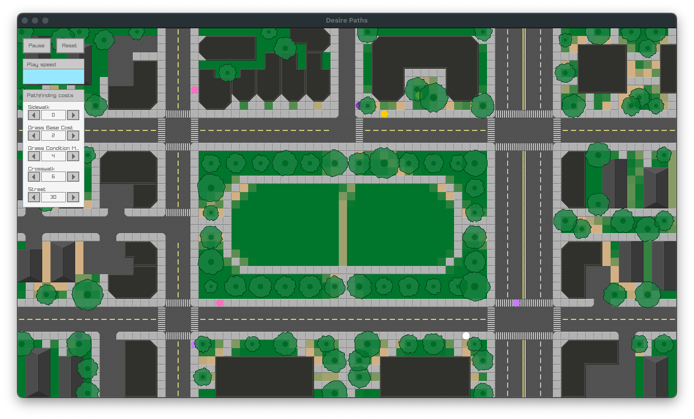

# Desire Paths

I created a simulation of [desire paths](https://en.wikipedia.org/wiki/Desire_path), small unplanned trails created as people take shortcuts through grass and ground cover. As these paths emerge, people tend to prefer them over untrodden areas. This was implemented using the A* pathfinding algorithm, with the g-cost determined both by the distance between nodes and by a cost penalty associated with the node's ground type. In the case of grassy nodes, the cost depends on the grass's condition, which is decreased each time a simulated agent steps on the node. These costs are parameterized and accessible through a GUI.

Web demo [here](https://colinmcculloughbenner.github.io/desire-paths-demo/).

